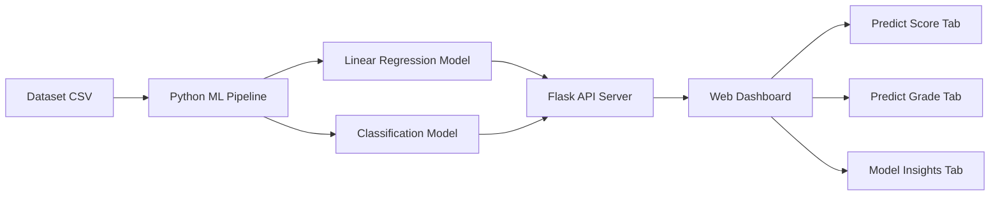

# Student Performance Prediction — Implementation Plan

## Overview

Build a **Student Performance Prediction** web application that uses **Linear Regression** (to predict exam scores) and a **Classification model** (to predict grade categories like A/B/C/D/F). The project includes a beautiful, interactive web dashboard for predictions and model insights.

## Architecture



## Tech Stack

| Layer | Technology |
|-------|------------|
| **ML Models** | Python, scikit-learn, pandas, numpy |
| **Backend API** | Flask (lightweight Python web server) |
| **Frontend** | HTML, CSS, JavaScript (no framework) |
| **Dataset** | Synthetic student performance data (generated in-project) |

## Dataset

We'll **generate a realistic synthetic dataset** (~1,000 students) with these features:

| Feature | Type | Range | Description |
|---------|------|-------|-------------|
| `study_hours_per_week` | Float | 0–40 | Weekly self-study hours |
| `attendance_percentage` | Float | 40–100 | Class attendance rate |
| `previous_exam_score` | Float | 20–100 | Score in last exam |
| `assignments_completed` | Int | 0–10 | Out of 10 assignments |
| `sleep_hours` | Float | 3–10 | Average sleep per night |
| `extracurricular_hours` | Float | 0–15 | Weekly extracurricular hours |
| `parent_education_level` | Cat | 1–4 | 1=None, 2=High School, 3=Bachelor, 4=Master+ |
| `internet_access` | Binary | 0/1 | Has internet at home |
| **Target: `exam_score`** | Float | 0–100 | Final exam score (regression target) |
| **Target: `grade`** | Cat | A/B/C/D/F | Derived from exam_score (classification target) |

> [!NOTE]
> Using a synthetic dataset ensures we have clean, well-structured data that clearly demonstrates both regression and classification concepts. The data generation will include realistic correlations (e.g., more study hours → higher scores).

## ML Models

### 1. Linear Regression (Score Prediction)
- Predict `exam_score` (continuous 0–100)
- Features: all numeric + encoded categorical
- Metrics shown: R² Score, MAE, RMSE
- Visualization: Actual vs Predicted scatter plot

### 2. Classification (Grade Prediction)
- Predict `grade` (A/B/C/D/F categories)
- Model: Random Forest Classifier (better than logistic for multi-class)
- Metrics shown: Accuracy, Precision, Recall, F1-Score
- Visualization: Confusion Matrix, Feature Importance

## Proposed Changes

### Project Structure

```
d:\antigravity_code\
├── app.py                    # Flask server + API endpoints
├── ml_pipeline.py            # Dataset generation, model training
├── generate_dataset.py       # Synthetic dataset generator
├── requirements.txt          # Python dependencies
├── models/                   # Saved trained models
│   ├── linear_model.pkl
│   └── classifier_model.pkl
├── data/
│   └── student_data.csv      # Generated dataset
├── static/
│   ├── css/
│   │   └── style.css         # Main stylesheet
│   ├── js/
│   │   └── app.js            # Frontend logic
│   └── images/               # Generated assets
└── templates/
    └── index.html            # Main dashboard page
```

---

### [NEW] generate_dataset.py
- Generate 1,000 synthetic student records with realistic correlations
- Save as `data/student_data.csv`

### [NEW] ml_pipeline.py
- Load and preprocess the dataset
- Train Linear Regression model → save as `models/linear_model.pkl`
- Train Random Forest Classifier → save as `models/classifier_model.pkl`
- Export model metrics (R², accuracy, confusion matrix, feature importance)

### [NEW] app.py
- Flask web server with routes:
  - `GET /` → Serve the dashboard
  - `POST /api/predict-score` → Linear Regression prediction
  - `POST /api/predict-grade` → Classification prediction
  - `GET /api/model-metrics` → Return model performance metrics
  - `GET /api/dataset-stats` → Return dataset statistics

### [NEW] templates/index.html
Beautiful dashboard with 3 tabs:
1. **Predict Score** — Input student features, get predicted exam score
2. **Predict Grade** — Input student features, get predicted grade (A–F)
3. **Model Insights** — Charts showing model performance, feature importance, data distributions

### [NEW] static/css/style.css
Premium dark-theme design with:
- Glassmorphism cards
- Gradient accents (purple → cyan)
- Smooth animations and transitions
- Responsive layout

### [NEW] static/js/app.js
- Tab navigation
- Form handling and API calls
- Chart.js for visualizations (confusion matrix, feature importance, distributions)
- Animated prediction results

## Web Dashboard Preview

The dashboard will feature:
- 🎨 **Dark theme** with glassmorphism effects
- 📊 **Interactive charts** (Chart.js) for model metrics
- 🔮 **Real-time predictions** via API calls
- 📱 **Responsive design** for desktop and mobile
- ✨ **Micro-animations** on hover, predictions, and transitions

## User Review Required

> [!IMPORTANT]
> **Python Required**: This project needs Python 3.8+ installed on your system. The following packages will be installed via `pip`:
> - Flask, scikit-learn, pandas, numpy, joblib
>
> Do you have Python installed and are you comfortable with `pip install`?

> [!NOTE]
> **Dataset**: We'll generate a synthetic dataset instead of downloading from Kaggle to avoid authentication issues. The synthetic data will have realistic patterns suitable for demonstrating both Linear Regression and Classification.

## Verification Plan

### Automated Tests
1. Run `python generate_dataset.py` — verify CSV is created with 1000 rows
2. Run `python ml_pipeline.py` — verify models are trained and metrics printed
3. Run `python app.py` — verify server starts and API endpoints respond
4. Browser test — verify dashboard loads and predictions work

### Manual Verification
- Test predictions with various input combinations
- Verify charts render correctly
- Check responsive layout on different screen sizes
